# Crypto Tracker

A production-grade cryptocurrency market tracker built with **Flutter**, demonstrating
Feature-First Clean Architecture, an offline-first data strategy, and a strong testing
and CI foundation.

Data is sourced from the public [CoinGecko API](https://www.coingecko.com/en/api).

**Repository:** [github.com/puinoongit/crypto_tracker_app](https://github.com/puinoongit/crypto_tracker_app)

---

## Table of Contents

- [Features](#features)
- [Screenshots](#screenshots)
- [Assignment Compliance](#assignment-compliance)
- [Architecture Overview](#architecture-overview)
- [Project Structure](#project-structure)
- [State Management & Dependency Injection](#state-management--dependency-injection)
- [Networking & Offline Strategy](#networking--offline-strategy)
- [Pagination & Search](#pagination--search)
- [Internationalization & Theming](#internationalization--theming)
- [Testing Strategy](#testing-strategy)
- [CI/CD Workflow](#cicd-workflow)
- [Known Limitations](#known-limitations)
- [Setup Instructions](#setup-instructions)

---

## Features

- 🌍 **Global market cap** — total market cap + 24h change and total 24h volume (`/global`).
- 🔥 **Trending coins** — horizontal carousel (`/search/trending`).
- 📈 **Market list** — infinite scroll pagination, pull-to-refresh, sparklines, and animated prices.
- 🔎 **Search** — dedicated tab with recent-search history; server-side CoinGecko search (≥ 2 chars) with 5-minute cache and offline fallback.
- 🪙 **Coin detail** — price, 24h change, market cap, volume, ATH/ATL (with % delta), supply stats, and sanitized description.
- ⭐ **Favorites** — mark/unmark with Hive persistence; reactive across Market, Search, and Detail.
- 📴 **Offline-first** — cached market, overview, detail, and search data served when offline, with an app-wide offline banner.
- 🌗 **Theme** — light, dark, and system.
- 🌐 **Localization** — English and Thai (plus system-locale detection).
- ⏱️ **Foreground polling** — optional 120 s auto-refresh on the Market tab while online (toggle in Settings).

---

## Screenshots

### Market

| English (dark) | English (dark · refreshing) |
|---|---|
| 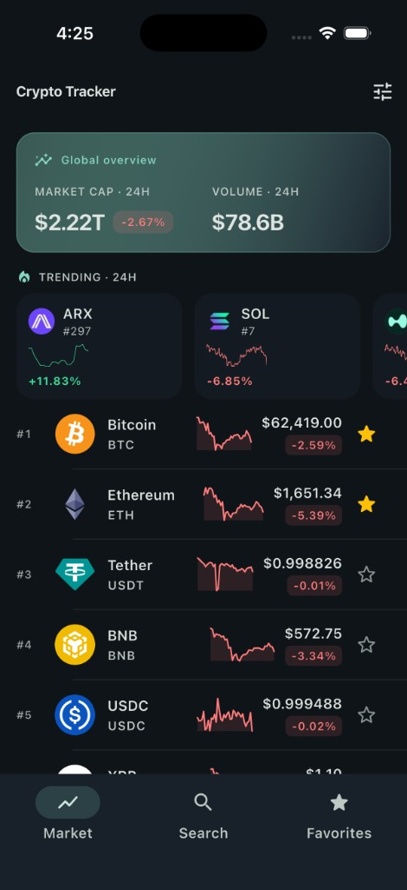 | 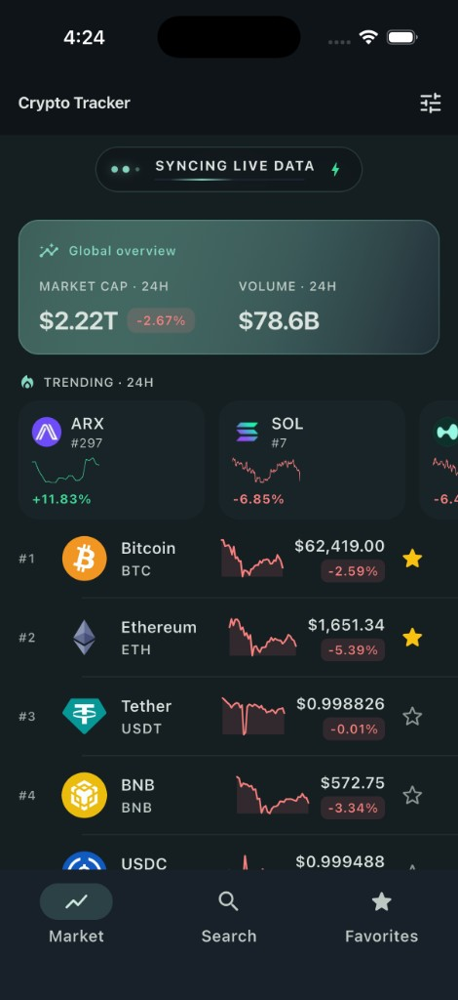 |

| Thai (light) | Thai (light · refreshing) |
|---|---|
| 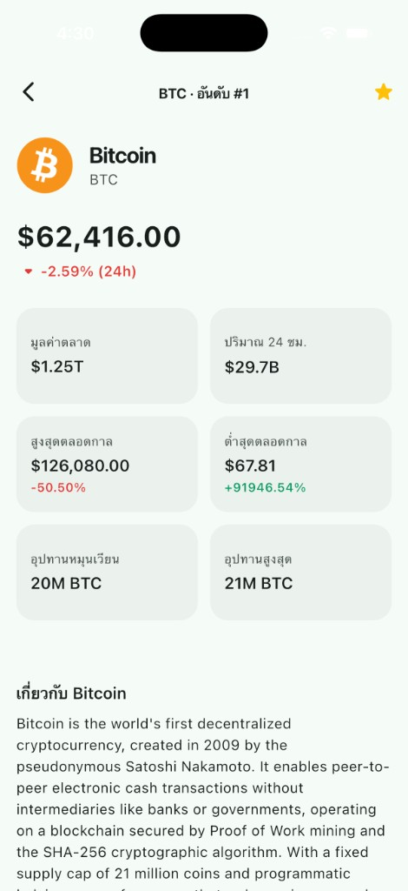 | 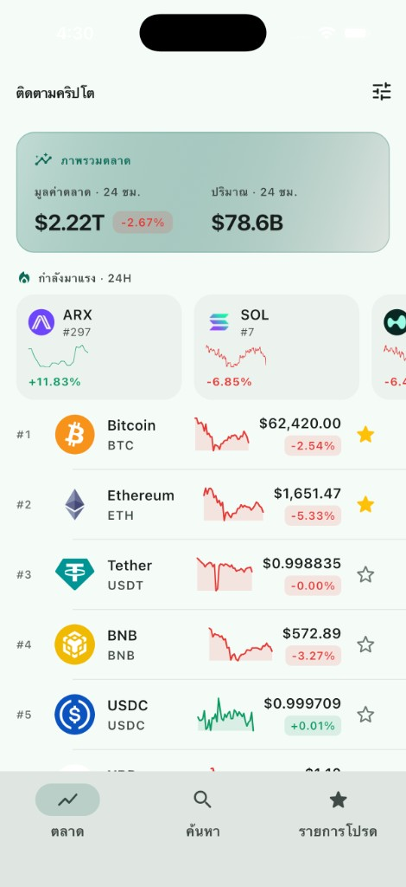 |

### Search

| Recent searches (EN) | Server search — "dog" (EN) |
|---|---|
| 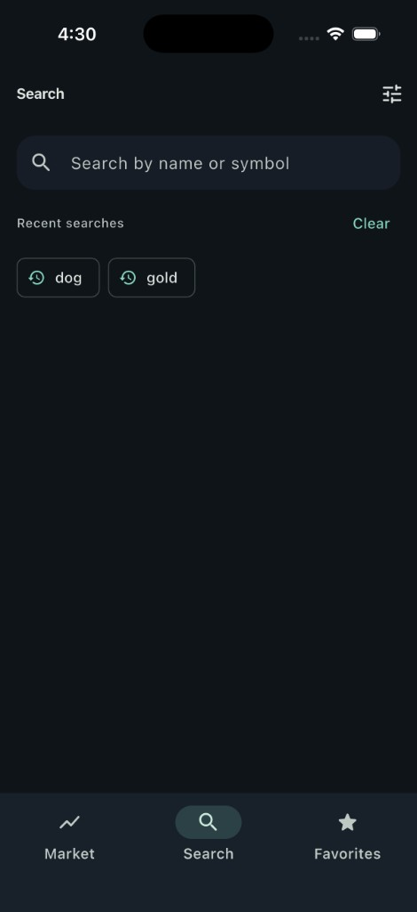 | 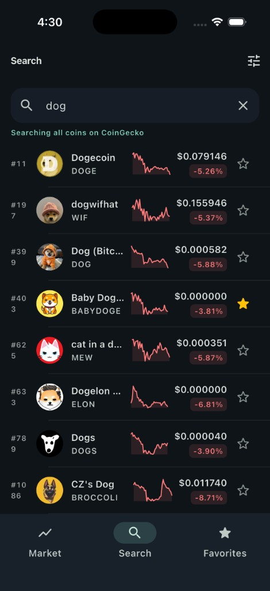 |

| Recent searches (TH) | Server search — "shiba" (TH) |
|---|---|
| 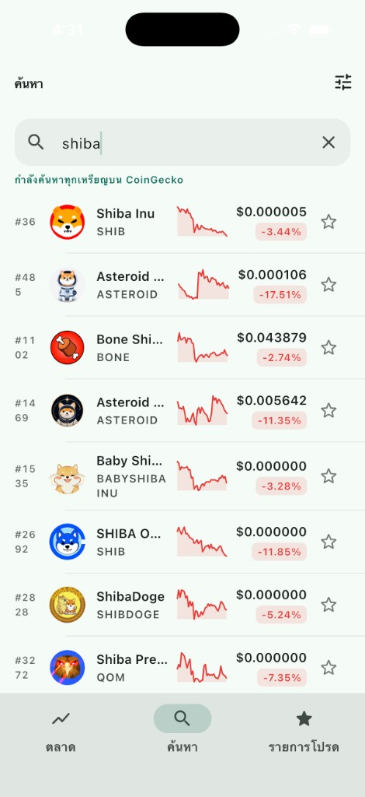 | 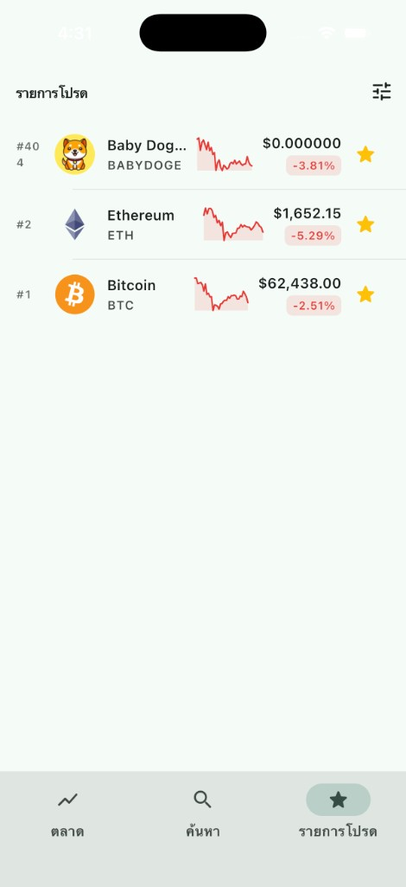 |

### Favorites

| English (dark) | Thai (light) |
|---|---|
| 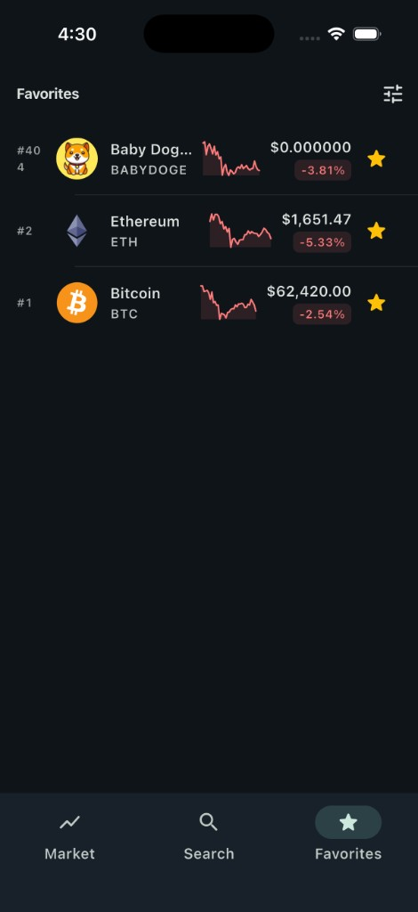 | 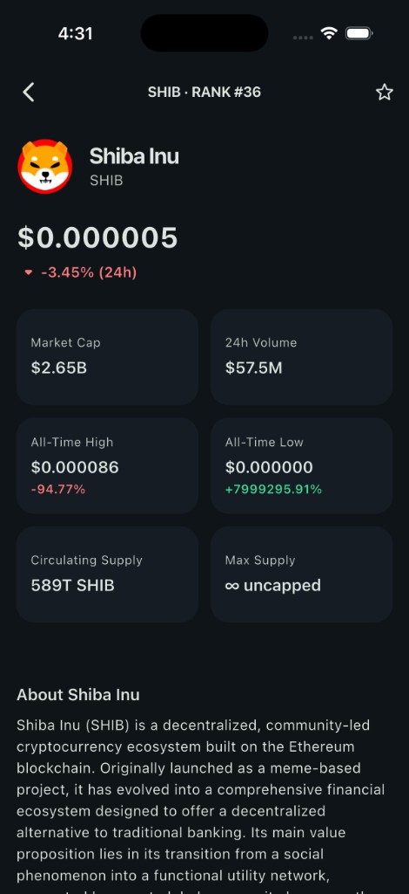 |

### Coin detail

| Bitcoin (TH, light) | Shiba Inu (EN, dark) |
|---|---|
| 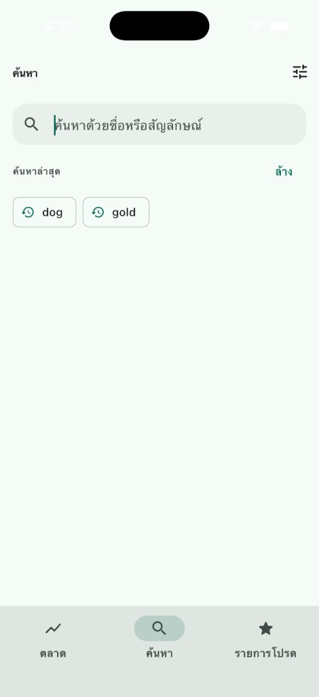 | 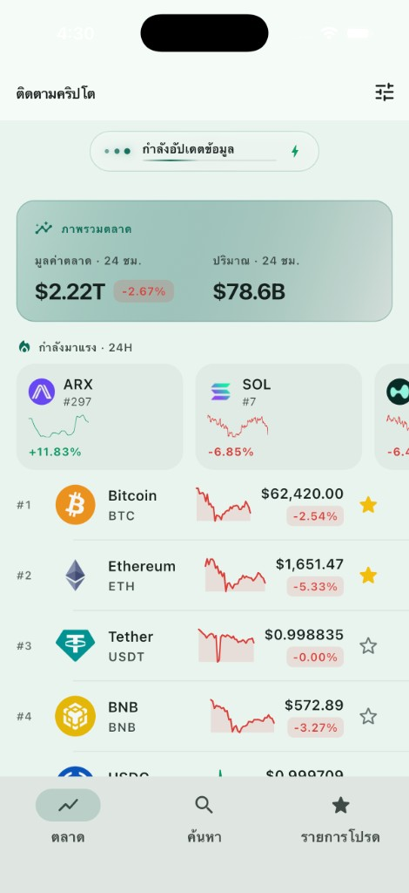 |

### Settings

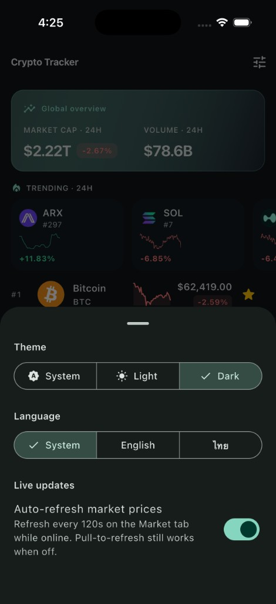

### Offline (cached data)

When there is no network, an app-wide banner appears and previously cached data is shown.

| Market | Coin detail (BTC) |
|---|---|
| 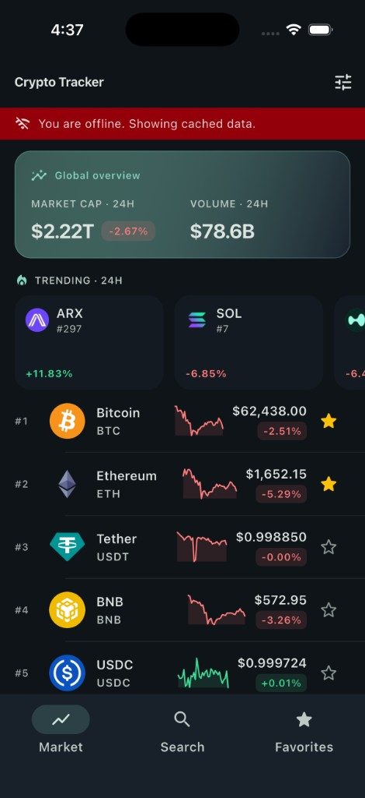 | 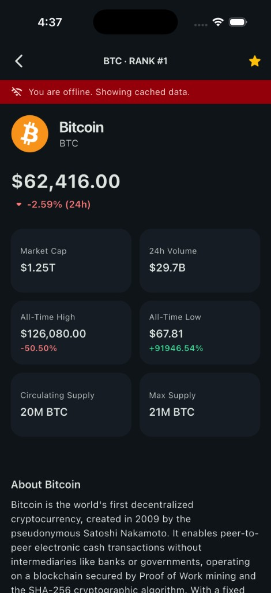 |

| Search — recent history | Search — cached "dog" results |
|---|---|
| 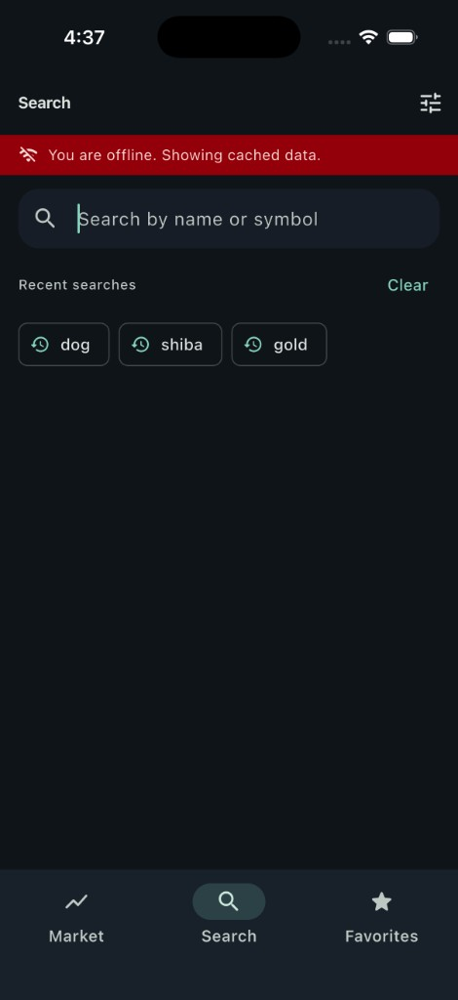 | 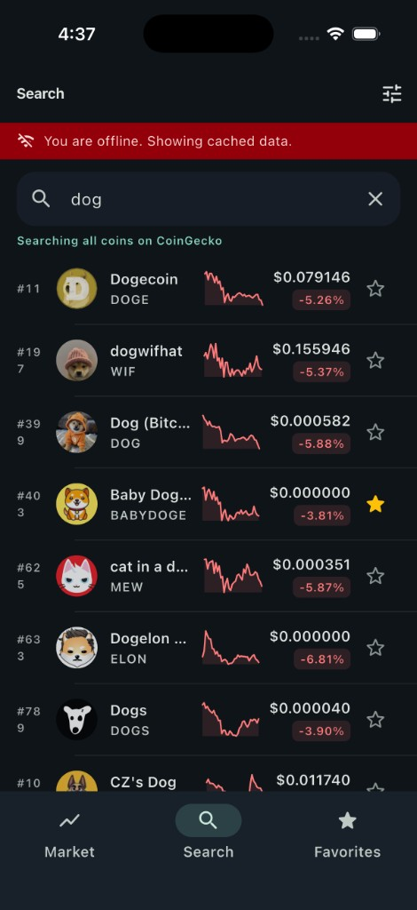 |

| Favorites |
|---|
| 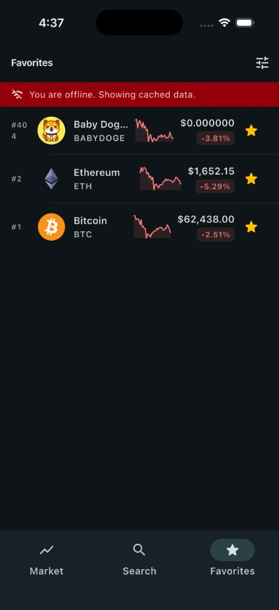 |

> **Screenshot note:** Loading shimmer skeletons, error/retry screens, and empty favorites are implemented and covered by widget tests but are not shown above.

---

## Assignment Compliance

### Functional requirements

| Requirement | Status | Where |
|---|---|---|
| Global market cap + trending + paginated list + search | ✅ | `home` + `search` features |
| Infinite scroll pagination | ✅ | `HomeViewModel.loadMore()` at 80% scroll |
| Coin detail screen | ✅ | `coin_detail` feature |
| Mark/unmark favorites + local persistence | ✅ | `favorites` feature — Hive `favorites` box |
| Pull to refresh | ✅ | `PullToRefreshList` on Market, Favorites, Detail |
| Loading / error / empty states | ✅ | Shimmer skeletons, `ErrorView`, `EmptyView` |
| Offline support (cache + display) | ✅ | Hive `CacheStore`, repository fallback, `OfflineBanner` |
| Dark / light theme (system) | ✅ | `SettingsController`, `ThemeMode` |
| Language switching (EN + native) | ✅ | `app_en.arb` / `app_th.arb` |

### Technical requirements

| Requirement | Status | Implementation |
|---|---|---|
| MVVM | ✅ | View + ViewModel + immutable State per screen |
| State management | ✅ | Riverpod (`Notifier` / `FamilyNotifier`) |
| Clean Architecture | ✅ | Feature-first `data / domain / presentation` |
| TDD | ✅ | **182 tests**, ~**77%** line coverage (`flutter_test` + `mocktail`) |
| REST API integration | ✅ | Dio + CoinGecko endpoints |
| Database | ✅ | Hive (cache + favorites + settings) |
| Dependency injection | ✅ | Riverpod providers, box overrides at bootstrap |
| CI (GitHub Actions) | ✅ | `.github/workflows/ci.yaml` |

### API endpoints (CoinGecko)

| Purpose | Endpoint |
|---|---|
| Paginated market list | `GET /coins/markets?vs_currency=usd&order=market_cap_desc&per_page=20&page={page}` |
| Global market cap | `GET /global` |
| Trending coins | `GET /search/trending` |
| Coin detail | `GET /coins/{id}?localization=false&tickers=false&market_data=true&...` |
| Server search | `GET /search?query={q}` → hydrate via `/coins/markets?ids=…` |

---

## Architecture Overview

The app follows **Feature-First Clean Architecture** with three strictly-separated layers.
Dependencies only ever point **inward** (Presentation → Domain ← Data); the Domain layer
has no knowledge of Flutter, Dio, or Hive.

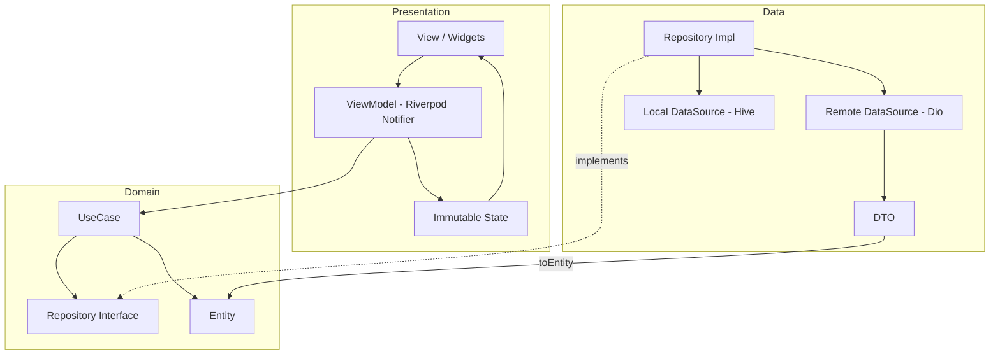

**Request flow (read path):**

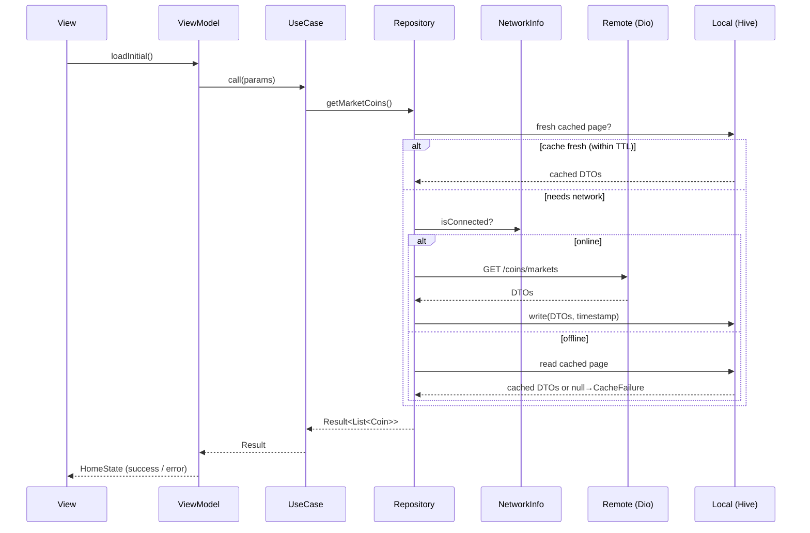

| Concern | Layer | Rationale |
|---|---|---|
| JSON keys, nullability | **DTO** (data) | API changes never leak past the data layer |
| Business intent | **UseCase** (domain) | ViewModels stay thin and testable |
| Framework state & rebuilds | **ViewModel + State** (presentation) | UI logic isolated from data |
| Raw exceptions → user-safe errors | **Repository** (data) | UI only sees domain `Failure`s |

---

## Project Structure

```
lib/
├── app/                         # Root widget, navigation shell, settings sheet
├── core/                        # Cross-cutting concerns
│   ├── cache/                   # CacheStore, Hive bootstrap, TTL policy
│   ├── config/                  # API config (base URL, timeouts, page size)
│   ├── error/                   # Exceptions, Failures, mappers
│   ├── localization/            # ARB files + generated AppLocalizations
│   ├── network/                 # Dio client, interceptors, NetworkInfo
│   ├── providers/               # Cross-cutting Riverpod providers
│   ├── settings/                # Theme + locale controller
│   ├── theme/                   # Material 3 light/dark themes
│   ├── usecase/                 # UseCase base contract
│   ├── utils/                   # Result, Debouncer, Formatters
│   └── widgets/                 # Shared widgets (error, empty, offline, pull-to-refresh)
└── features/
    ├── home/                    # Market list, global overview, trending
    ├── search/                  # Dedicated search tab + recent history
    ├── coin_detail/             # Coin detail screen
    └── favorites/               # Favorites list
```

Each feature mirrors the same `data / domain / presentation` shape so the codebase scales
by **adding features**, not by growing shared god-files.

---

## State Management & Dependency Injection

**Riverpod** handles both state management and dependency injection.

- **Compile-safe DI** — providers resolve without a service locator; every dependency is
  overridable in tests.
- **Immutable state** — each screen has a single `Equatable` state object with explicit
  transitions.
- **Minimal rebuilds** — `select` and `family` providers (e.g. `isFavoriteProvider(id)`)
  rebuild only the widgets whose slice of state changed.
- **Layered wiring** — `dioProvider` → data sources → repositories → use cases → view models.

Hive boxes are opened **before** `runApp` and injected via `ProviderScope` overrides
(`buildBoxOverrides()`), so the first frame can read persisted settings synchronously.

---

## Networking & Offline Strategy

Built on **Dio** with shared configuration:

- Connect timeout 15 s, receive timeout 20 s.
- **Request pacing** — minimum 700 ms gap between outbound calls (CoinGecko free-tier).
- **Retry interceptor** — exponential backoff for timeouts, connection errors, `429`/`5xx`;
  `429` retried at most once with `Retry-After` support.
- **Exception mapping** — `DioException` → data exception → domain `Failure`; raw exceptions
  never reach the UI.

### Caching (Hive)

Payloads are stored as JSON strings in a `{ savedAt, data }` envelope (`CacheStore`).

| Cached resource | Box | TTL |
|---|---|---|
| Market list (per page) | `market_cache` | 10 minutes |
| Market page 1 (foreground poll) | `market_cache` | 120 seconds |
| Global market + trending | `market_cache` | 10 minutes |
| Server search results | `market_cache` | 5 minutes |
| Coin detail | `coin_detail_cache` | 30 minutes |
| Favorites | `favorites` | Never expires |

When offline, repositories fall back to cached data (even if stale). An `OfflineBanner` is
shown app-wide via a `StreamProvider` driven by `connectivity_plus`.

Pull-to-refresh passes `forceRefresh: true` and always bypasses the cache.

---

## Pagination & Search

- **Infinite scroll** — prefetch at 80% scroll extent; duplicate-request and race guards in
  `HomeViewModel`.
- **End-of-list** — detected when a page returns fewer than `pageSize` items.
- **Search tab** — recent searches persisted locally; server search (≥ 2 chars, 300 ms debounce)
  via `GET /search` → hydrate ids via `/coins/markets`.
- **Favorites price sync** — `favoriteDisplayCoinsProvider` overlays Market-list prices onto
  favorites when the same coin is already loaded.

### Foreground polling

When the Market tab is selected, the app is in foreground, online, and not searching, page 1
refreshes every **120 s** (cache-aware, not `forceRefresh`). Controlled by
`marketPollingActiveProvider`; can be disabled in Settings.

---

## Internationalization & Theming

- **i18n** — `flutter_localizations` + `gen-l10n` (`app_en.arb`, `app_th.arb`). Error copy
  is localized via `localizeFailure`.
- **Theming** — Material 3 light/dark from a single seed color; `ThemeMode` and locale
  persisted in Hive and applied instantly.

### Motion

Fintech-style motion with implicit animations only (no extra packages):

- Count-up numbers on price and market-cap fields.
- Shimmer skeletons while loading.
- Staggered list/card entrance animations.
- Hero morph from list avatar to detail screen.
- Elastic favorite-star toggle and glass pull-to-refresh pill.

---

## Testing Strategy

**182 tests**, deterministic and independent, using `flutter_test` + `mocktail`.
Line coverage is **~77%**.

| Layer | Examples |
|---|---|
| Use cases | `get_market_coins_test`, `get_coin_detail_test`, `search_coins` |
| Repositories | Offline-first logic, cache fallback, TTL, failure mapping |
| ViewModels | Pagination, search, polling, race/duplicate guards |
| Data sources / DTOs | Serialization, null coercion, Hive round-trips |
| Core | `Result`, interceptors, cache TTL, formatters |
| Widgets | Home, Detail, Favorites, Search, Settings, pull-to-refresh |

```bash
flutter test                 # run the suite
flutter test --coverage      # generate coverage/lcov.info
```

---

## CI/CD Workflow

GitHub Actions (`.github/workflows/ci.yaml`) runs on every push/PR to `master`:

1. `flutter pub get`
2. `flutter gen-l10n`
3. `dart format --set-exit-if-changed .`
4. `flutter analyze`
5. `flutter test --coverage`
6. `flutter build apk --release`

Coverage is uploaded as a build artifact.

---

## Known Limitations

- **CoinGecko free tier** — rate-limited (`429` possible); pacing, cache, and a single retry
  keep the app usable.
- **Polling is foreground-only** — 120 s interval on the Market tab; disable in Settings.
- **Favorites off-market** — coins not yet on the Market tab fetch prices via a separate path.

---

## Setup Instructions

### Prerequisites

- Flutter **3.44.x** (Dart **3.12.x**)
- Android SDK / Xcode for device builds

### Run

```bash
# 1. Install dependencies
flutter pub get

# 2. Generate localizations (also runs automatically on build)
flutter gen-l10n

# 3. (Optional) CoinGecko API key — reduces 429 rate-limit errors
cp env.json.example env.json
# Edit env.json and paste your key from https://www.coingecko.com/en/api

# 4. Run on a connected device / emulator
flutter run --dart-define-from-file=env.json

# 5. Build a release APK (with API key)
flutter build apk --release --dart-define-from-file=env.json
```

Without `env.json`, the app works on CoinGecko's public endpoint (stricter rate limits).
The key is compiled at build time via `--dart-define` and is **not** read from a runtime
`.env` file on the device.

**Single define (no file):**

```bash
flutter run --dart-define=COINGECKO_API_KEY=CG-your-key-here
```

Use `COINGECKO_API_KEY_TYPE=pro` for a Pro API key (default is `demo`).

### Useful commands

```bash
flutter analyze                      # static analysis
dart format .                        # format code
flutter test --coverage              # tests + coverage
dart run flutter_launcher_icons      # regenerate launcher icons
```

> **Note:** If requests return `429`, the app spaces out calls (700 ms pacing), retries once
> with backoff, and serves cached data in the meantime. An API key significantly raises your quota.
